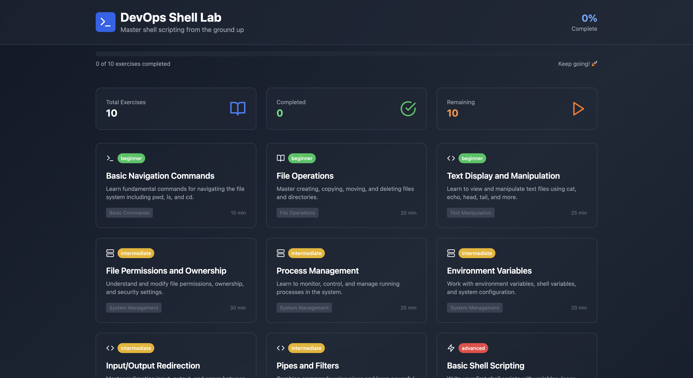

# DevOps Shell Scripting Lab

A comprehensive, interactive learning environment for mastering shell scripting from the basics to advanced concepts. This containerized application provides hands-on experience with 10 carefully crafted exercises covering essential DevOps skills.

## 👀 Sneak Peek



## 🚀 Features

- **Interactive Learning**: 10 progressive exercises from beginner to advanced
- **Simulated Terminal**: Safe practice environment with realistic shell simulation
- **Theory + Practice**: Each exercise includes comprehensive theory and hands-on practice
- **Progress Tracking**: Monitor your learning journey with completion tracking
- **Responsive Design**: Works seamlessly on desktop, tablet, and mobile devices
- **Dockerized**: Easy deployment on any machine with Docker support

## 📚 Exercise Curriculum

1. **Basic Navigation Commands** - pwd, ls, cd fundamentals
2. **File Operations** - Creating, copying, moving, and deleting files
3. **Text Display and Manipulation** - cat, echo, head, tail, wc
4. **File Permissions and Ownership** - chmod, chown, understanding security
5. **Process Management** - ps, kill, job control
6. **Environment Variables** - Working with system configuration
7. **Input/Output Redirection** - Streams, pipes, and redirection
8. **Pipes and Filters** - grep, sort, uniq, cut, and command chaining
9. **Basic Shell Scripting** - Variables, loops, conditionals
10. **Functions and Advanced Scripting** - Modular code, error handling

## 🐳 Docker Deployment

### Quick Start with Docker

```bash
# Build and run the container
docker build -t devops-shell-lab .
docker run -p 3000:80 devops-shell-lab
```

### Using Docker Compose (Recommended)

```bash
# Start the application
docker-compose up -d

# View logs
docker-compose logs -f

# Stop the application
docker-compose down
```

The application will be available at `http://localhost:3000`

### Production Deployment

For production environments, consider:

```bash
# Build for production
docker build -t devops-shell-lab:prod .

# Run with resource limits
docker run -d \
  --name devops-shell-lab \
  --restart unless-stopped \
  --memory=512m \
  --cpus=1 \
  -p 80:80 \
  devops-shell-lab:prod
```

## 💻 Local Development

```bash
# Install dependencies
npm install

# Start development server
npm run dev

# Build for production
npm run build

# Preview production build
npm run preview
```

## 🎯 Learning Path

1. **Start with Exercise 1**: Begin with basic navigation commands
2. **Progress Sequentially**: Each exercise builds upon previous knowledge
3. **Read Theory First**: Understand concepts before practicing
4. **Use the Playground**: Practice commands in the interactive terminal
5. **Complete Tasks**: Track progress by completing exercise tasks
6. **Repeat and Reinforce**: Revisit exercises to strengthen understanding

## 🛠 Technical Stack

- **Frontend**: React 18 with TypeScript
- **Styling**: Tailwind CSS with custom dark theme
- **Routing**: React Router for navigation
- **Icons**: Lucide React for consistent iconography
- **Build Tool**: Vite for fast development and building
- **Container**: Multi-stage Docker build with Nginx
- **Web Server**: Nginx with optimized configuration

## 📱 Browser Support

- Chrome/Chromium 90+
- Firefox 88+
- Safari 14+
- Edge 90+

## 🔧 Configuration

### Environment Variables

The application uses default configuration, but you can customize:

- `PORT`: Server port (default: 80 in container)
- `NODE_ENV`: Environment mode

### Nginx Configuration

The included `nginx.conf` provides:
- Gzip compression
- Security headers
- Static asset caching
- Client-side routing support

## 🚀 Production Considerations

- **Resource Requirements**: Minimum 512MB RAM, 1 CPU core
- **Health Checks**: Built-in health check endpoints
- **Logging**: Nginx access and error logs
- **Security**: HTTPS termination should be handled by reverse proxy
- **Scaling**: Stateless design allows horizontal scaling

## 🤝 Contributing

This lab environment is designed to be extensible. To add new exercises:

1. Add exercise data to `src/data/exercises.ts`
2. Follow the existing exercise structure
3. Include theory, commands, examples, and tasks
4. Test the interactive playground functionality

## 📄 License

This project is open source and available under the MIT License.

## 🎓 Learning Objectives

By completing this lab, you will:

- Master essential shell commands and navigation
- Understand file permissions and system security
- Learn process management and system monitoring
- Practice text manipulation and data processing
- Write shell scripts with proper error handling
- Develop DevOps automation skills
- Gain confidence in Linux/Unix command line environments

---

**Ready to become a shell scripting expert?** 🚀

Start your journey by running the lab and beginning with Exercise 1!
